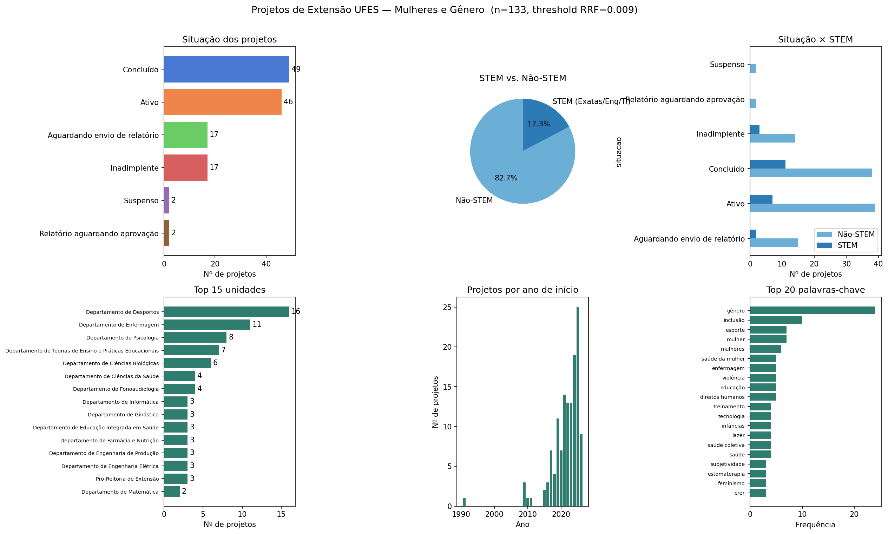

# Projeto Dados GIRLS

Mapeamento de projetos de extensão da UFES com temática de **gênero e mulheres**, com recorte específico para **STEM** (Exatas, Engenharia e TI).

O repositório contém duas partes:

1. **Coleta** — scraper assíncrono que baixa todos os projetos de extensão da UFES a partir da API pública do portal de projetos.
2. **Análise** — pipeline de recuperação de informação híbrida (BM25 + embeddings densos, fundidos via Reciprocal Rank Fusion) que ranqueia os projetos por relevância à temática de gênero, aplica um threshold de corte e gera datasets e visualizações.

## Resultados (última execução)

| Métrica | Valor |
|---|---|
| Projetos de extensão coletados | 2.829 |
| Projetos com temática de gênero/mulheres identificados | 133 |
| Destes, em unidades STEM (estreito) | 23 (~17%) |



## Estrutura do repositório

```
.
├── scraper.py                  # Ponto de entrada da coleta
├── analise_genero.py           # Ponto de entrada da análise
├── src/
│   ├── coleta/
│   │   └── scraper.py          # Scraper assíncrono da API da UFES
│   └── analise/
│       ├── config.py           # Parâmetros, caminhos, keywords e queries
│       ├── pipeline.py         # Orquestrador do pipeline
│       ├── texto.py            # Normalização e concatenação de texto
│       ├── bm25.py             # Scoring léxico (BM25)
│       ├── embeddings.py       # Scoring semântico (e5-base) com cache
│       ├── fusao.py            # Reciprocal Rank Fusion (RRF)
│       ├── classificacao.py    # Classificação STEM vs. não-STEM
│       └── visualizacao.py     # Gráficos (matplotlib/seaborn)
├── data/
│   ├── brutos/                 # Saída do scraper (CSV + JSON)
│   ├── cache/                  # Cache de embeddings (.npy)
│   └── processados/            # Saídas do pipeline de análise
└── outputs/
    └── figuras/                # Gráficos gerados (.png)
```

## Instalação

Requer **Python 3.12+**. Instale as dependências:

```bash
pip install pandas numpy aiohttp rank-bm25 sentence-transformers matplotlib seaborn
```

> `sentence-transformers` instala o PyTorch como dependência. O pipeline usa GPU (CUDA) automaticamente se disponível; caso contrário roda em CPU. Se faltar VRAM, reduza `BATCH_SIZE` em [src/analise/config.py](src/analise/config.py).

## Uso

### 1. Coleta dos dados

```bash
python scraper.py                  # coleta todos os projetos de extensão
python scraper.py --retry-missing  # refaz apenas projetos cujo resumo veio nulo
```

- **Fonte:** [projetos.ufes.br](https://projetos.ufes.br/#/consulta-projetos), via API `https://pib-api.prod.uks.ufes.br/`.
- Busca a lista completa de projetos do tipo *Extensão* (todas as situações) e, para cada um, enriquece com as abas **Informações** (resumo, palavras-chave) e **Extensão** (apresentação, unidade), com 15 requisições simultâneas e retry com backoff exponencial.
- Saídas: `data/brutos/projetos_extensao.csv` e `.json`.
- Falhas de rede pontuais deixam o `resumo` nulo — por isso existe o modo `--retry-missing`, que re-busca só esses registros.

### 2. Análise de gênero

```bash
python analise_genero.py
```

O pipeline executa as seguintes etapas (ver [src/analise/pipeline.py](src/analise/pipeline.py)):

1. **Preparação do corpus** — concatena título, resumo, palavras-chave e apresentação de cada projeto ([texto.py](src/analise/texto.py)); normaliza (minúsculas, sem acentos, só alfanuméricos).
2. **Score léxico (BM25)** — pontua cada projeto contra um conjunto de keywords de gênero em português (com variações sem acento) e inglês ([bm25.py](src/analise/bm25.py)).
3. **Score semântico (denso)** — codifica os projetos com o modelo [`intfloat/multilingual-e5-base`](https://huggingface.co/intfloat/multilingual-e5-base) (prefixos `passage:`/`query:` conforme a spec do e5) e calcula a similaridade de cosseno máxima contra 6 queries temáticas ([embeddings.py](src/analise/embeddings.py)). Os embeddings dos documentos são cacheados em `data/cache/` e só recalculados se o conjunto de projetos mudar.
4. **Fusão (RRF)** — combina os dois rankings via Reciprocal Rank Fusion com `k=60` ([fusao.py](src/analise/fusao.py)). O RRF usa apenas as posições nos rankings, o que dispensa normalizar escalas de score incompatíveis.
5. **Corte por threshold** — projetos com `score_rrf >= THRESHOLD_RRF` são classificados como de temática de gênero. O terminal imprime o top 15 e a "borda do corte" (±15% do threshold) para facilitar a calibração.
6. **Classificação STEM** — marca projetos de unidades do CT/CCE ou com keywords STEM no nome da unidade, excluindo Educação Física ([classificacao.py](src/analise/classificacao.py)).
7. **Visualizações e sumário** — gera os gráficos e imprime estatísticas por situação, unidade e STEM.

### Calibrando o threshold

O threshold do corte é o principal parâmetro do pipeline. Para ajustá-lo:

1. Rode o pipeline e observe o histograma `outputs/figuras/distribuicao_scores.png` (o threshold atual aparece como linha tracejada) e a listagem da "borda do corte" no terminal.
2. Edite `THRESHOLD_RRF` em [src/analise/config.py](src/analise/config.py).
3. Reexecute — os embeddings vêm do cache, então a reexecução é rápida.

Use `data/processados/projetos_genero_revisao.csv` para revisão manual: ele traz scores, título, palavras-chave e resumo lado a lado, ordenados por relevância.

## Arquivos gerados

| Arquivo | Conteúdo |
|---|---|
| `data/brutos/projetos_extensao.csv` / `.json` | Todos os projetos de extensão coletados (id, título, datas, situação, coordenador, unidade, resumo, palavras-chave, apresentação) |
| `data/cache/embeddings.npy` / `ids.npy` | Cache dos embeddings dos documentos |
| `data/processados/scores_genero.csv` | Todos os projetos com `score_bm25`, `score_dense` e `score_rrf`, ordenados por relevância |
| `data/processados/projetos_genero.csv` | Apenas os projetos acima do threshold, com todos os campos originais + scores + flag `is_stem` |
| `data/processados/projetos_genero_revisao.csv` | Versão enxuta do anterior, para revisão manual |
| `outputs/figuras/distribuicao_scores.png` | Histogramas dos 3 scores, com o threshold marcado |
| `outputs/figuras/analise_genero.png` | Painel com 6 gráficos: situação, STEM vs. não-STEM, situação × STEM, top unidades, evolução temporal e top palavras-chave |

## Configuração

Tudo é centralizado em [src/analise/config.py](src/analise/config.py):

| Parâmetro | Padrão | Descrição |
|---|---|---|
| `THRESHOLD_RRF` | `0.009` | Corte do score RRF para classificar como temática de gênero |
| `EMBED_MODEL` | `intfloat/multilingual-e5-base` | Modelo de embeddings |
| `K_RRF` | `60` | Constante do RRF (valor canônico da literatura) |
| `BATCH_SIZE` | `64` | Batch do encoding (reduzir se faltar VRAM) |
| `KEYWORDS_BM25` | — | Keywords léxicas da busca BM25 |
| `DENSE_QUERIES` | — | Queries semânticas da busca densa |
| `STEM_CENTROS` / `STEM_KW_UNIT` / `STEM_KW_EXCL` | — | Critérios da classificação STEM |

No scraper, a concorrência é controlada por `CONCURRENCY` em [src/coleta/scraper.py](src/coleta/scraper.py).

## Metodologia: por que busca híbrida?

- **BM25 sozinho** só encontra projetos que usam literalmente as keywords — perde projetos que falam de "equidade", "empoderamento feminino" etc. com outro vocabulário.
- **Embeddings sozinhos** capturam semântica, mas podem dar score alto a temas apenas adjacentes (saúde, inclusão em geral).
- A **fusão RRF** exige que o projeto ranqueie bem em pelo menos um dos sinais — e recompensa quem ranqueia bem em ambos — combinando precisão léxica com recall semântico sem precisar calibrar pesos entre escalas de score diferentes.
